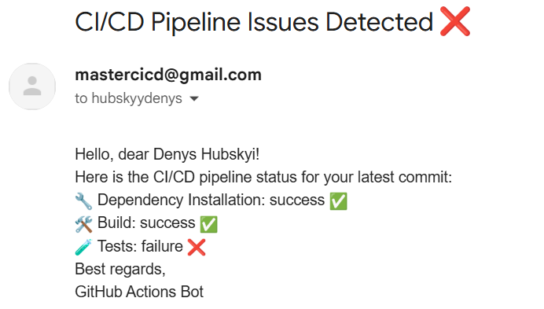

# CICDPipelines
A GitHub repository for learning and experimenting with GitHub actions and building CI/CD pipelines
The latest functionality:

- automated email notifications after git pushes: dependency installation, build, and test results are sent to the product owner/project manager
